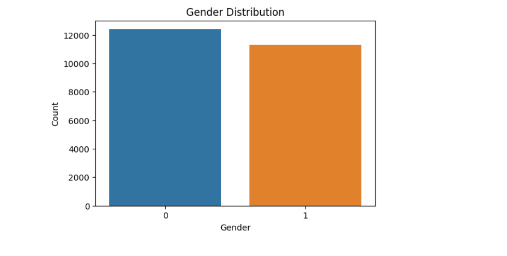

# FaceMystique-Predicting-Age-and-Gender-from-Portraits
## Overview 1
This project aims to predict the gender and approximate age of individuals based on facial images using a dataset containing age and gender labels.

## Dataset
The project utilizes the UTKFace dataset, a collection of grayscale facial images, each annotated with age and gender labels. You can find this dataset [here](https://www.kaggle.com/jangedoo/utkface-new).

## Exploratory Data Analysis (EDA)
In this section, we perform an exploratory data analysis to gain insights into the dataset.

### Basic Statistics
- **DataFrame Shape:** (23407, 3)
- **Data Types:** The DataFrame contains image paths, age labels, and gender labels.
- **Missing Values:** There are no missing values in the dataset.

### Age Distribution
- We visualize the age distribution using a histogram with a kernel density estimate (KDE) overlay, separated by gender.
  - **Result:**The graph shows that the count for male is higher than gender female for ages 0 to 60, while the count for gender female is higher than gender male for ages 60 to 120.  The distribution is skewed to the right, with a longer tail on the right side of the graph.

### Gender Distribution
- We visualize the gender distribution using a countplot.
  - **Result:** The dataset contains a relatively balanced distribution of gender, with slightly more number of males than females.

### Age vs. Gender
- We explore the relationship between age and gender using a boxplot.
  - **Result:** The boxplot reveals that the median age for females is slightly lower than for males, indicating a subtle age difference between genders.

### Age Distribution by Gender (Violin Plot)
- We use a violin plot to visualize the age distribution by gender.
  - **Result:** The violin plot provides a detailed view of the age distribution by gender, showing that the majority of individuals in both genders are in their 20s and 30s.

### Pairplot
- We create a pairplot to visualize relationships between variables, with gender as a hue.
  - **Result:** The pairplot reveals potential correlations between age and gender with respect to other variables in the dataset, providing valuable insights into the data's structure.

## Overview 2
This project showcases a deep learning approach to predict the gender and approximate age of individuals from facial images. Leveraging the power of convolutional neural networks (CNNs), this model is designed to provide accurate gender and age predictions.

## Dataset
The project utilizes the UTKFace dataset, a rich resource of grayscale facial images, each annotated with age and gender labels. This dataset is publicly available on Kaggle and can be downloaded [here](https://www.kaggle.com/jangedoo/utkface-new).

## Model Architecture
The heart of this project is a well-crafted deep learning model with the following architecture:

- **Convolutional Layers**: Multiple convolutional layers to automatically extract meaningful features from facial images.
- **Pooling Layers**: Max-pooling layers to downsample the feature maps.
- **Fully Connected Layers**: Dense layers for high-level feature aggregation.
- **Output Branches**: The model has two output branches:
  - Gender Prediction: Utilizes binary cross-entropy loss for accurate gender classification.
  - Age Prediction: Uses mean absolute error (MAE) loss to approximate the age of the individual.

The use of two output branches allows the model to simultaneously predict both gender and age, providing a comprehensive analysis of facial data.

## Training
The model is trained using a carefully curated dataset split into training and validation sets. The training process includes the following key details:

- **Loss Functions**: Binary cross-entropy for gender prediction and MAE for age prediction.
- **Optimizer**: The Adam optimizer is employed to efficiently update model weights.
- **Batch Size**: Training is conducted in batches of 32 samples.
- **Epochs**: The model undergoes 30 epochs to ensure robust learning.

## Results
The performance of the trained model is evaluated on both gender and age prediction tasks. The model's accuracy and loss metrics are visualized over training epochs, allowing for an in-depth analysis of its learning process.

## Usage
You can run this project directly in a Kaggle notebook. Follow these steps:

1. Open the Kaggle notebook associated with this project.
2. Ensure access to the UTKFace dataset on Kaggle or upload it if necessary.
3. Execute the notebook cells one by one to load data, build and train the model, and make predictions.

## Requirements
Ensure you have the following dependencies installed:

- TensorFlow
- NumPy
- Pandas
- Matplotlib
- Pillow (PIL)
- tqdm
